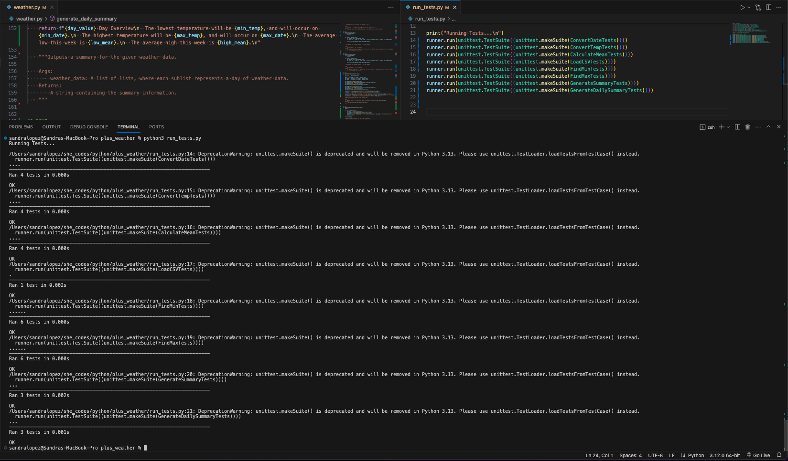

# Sandra Lopez - PLUS WEATHER

## About This Project
Every day we collect data about the weather to predict the forecast for the coming days. The problem is that this data is never in a human-readable format, that’s where you come in! Your task is to process CSV files containing data about the weather and convert them into meaningful text-based summaries.

## Project TESTS
- [x] ALL weather data tests passed
    
